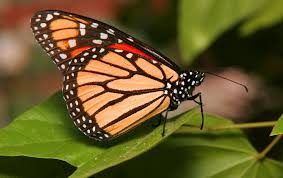

# GMM-EM Image Segmentation

This project implements image segmentation using **Gaussian Mixture Models (GMM)** and **Dirichlet Process Gaussian Mixture Models (DPGMM)** through the **Expectation-Maximization (EM)** algorithm. It combines color features and texture (via Local Binary Patterns) for unsupervised segmentation.

---

## 🔍 Overview

- Segments images based on **color (LAB space)** and **texture (LBP descriptors)**.
- Uses both **GMM** and **Bayesian GMM (DPGMM)** for clustering.
- Supports unsupervised learning without labeled data.
- Employs **scikit-learn**, **OpenCV**, and **scikit-image** for processing and modeling.
- Outputs a segmented version of the input image with distinct color-coded regions.
> Achieves up to **0.917 Jaccard similarity coefficient** on test images.

---

## 📊 Visualization

| Input Image | Output Image |
|-------------|--------------|
|  |  |
|  |  |

---

## ⚙️ Setup Instructions

### 1. Clone the repository

```bash
git clone https://github.com/Shivam2Goyal/GMM-Segmentation.git
cd gmm-segmentation
```
### 2. Run the Script(run.sh)
<p>Place your image in the input directory and update the filename accordingly.</p>

```bash
chmod +x run.sh
./run.sh
```
### 3. Requirements
Make sure these dependencies are listed in your `requirements.txt`

```text
matplotlib
opencv-python
numpy
scikit-learn
scikit-image
```
